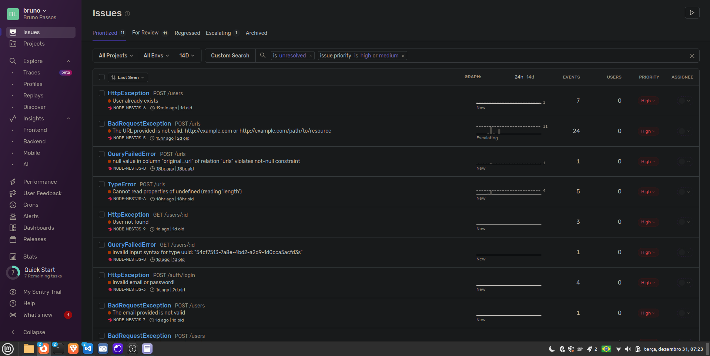
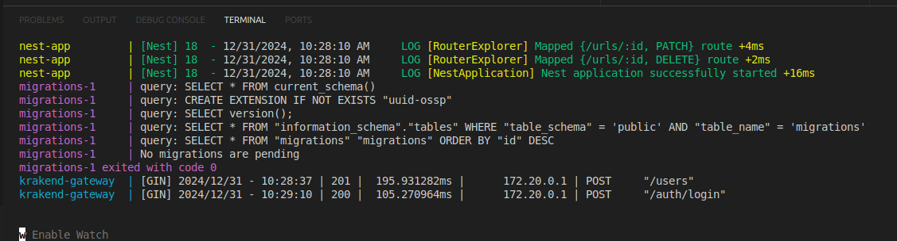

# ShorTeddy

## Sessões do README

```bash
1 - O que você precisa saber antes de rodar o projeto?
2 - Como rodar o Projeto
3 - Explicações sobre decisões tomadas no projeto
4 - Melhorias futuras
```

## O que você precisa saber antes de rodar o projeto?

```bash
1 - Antes de iniciar o setup, é necessário que o Docker esteja em execução.
2 - Variáveis de ambiente necessárias já estão sendo disponibilizadas (`.env.example`) pois é um projeto de teste.
3 - Versão do Node suportada: 22.12.0
```

## Como rodar o projeto

## 1. Faça o clone do repositório

```bash
git clone <URL_DO_REPOSITORIO>
```


## 2. Entre na pasta ```shorteddy``` e rode o setup

```bash
cd shorteddy
crie um arquivo .env na raiz do projeto e copie o conteúdo de .env.example para .env
npm run setup
```

Obs: Utilize esse comando somente na primeira vez que for rodar a aplicação. Esse comando irá instalar todas as dependencias, subir o banco, aplicação e API Gateway no docker e iniciar o projeto.

## 3. Rode o projeto:

Caso precise rodar o projeto novamente, é só rodar o comando abaixo:

```bash
npm run docker:compose
```

## 4. Documentação

Entre no endereço `http://localhost:3000/api`


## 5. Testes

```bash
npm run test
```

## 6. AWS

Endereço da aplicação rodando em um AWS EC2 `http://18.230.11.251:3000/`


# Explicações sobre decisões tomadas no projeto

## Sentry

Implementei o Sentry como ferramenta de monitoramento de logs. Durante o uso percebi que existe um delay entre o erro acontecer e o sentry notificar na plataforma. Porém, os logs estão sendo coletados conforme print abaixo:



O mesmo erro que enfrentei em relação ao Sentry subindo a aplicação para a AWS você vai enfrente clonando o repositório, como não consegui chegar a solução, decidi por remover o sentry do projeto.

## KrakenD

Foi o maior desafio da implementação e onde gastei mais tempo.

Não obtive sucesso na implementação completa do KrakenD, as rotas que necessitam de autenticação não estavam passando o body para o backend, se fosse removida a autenticação na configuração do KrakenD, tudo funcionava normalmente. Sendo assim, deixei a implementação na aplicação como forma de demonstrar até onde consegui chegar. Se fizer um teste de criar usuário e logar usando o endereço do API Gateway (`http://localhost:8081/`) será possível ver os logs no console:



Outras rotas que necessitam de autenticação não vão funcionar. Nesse caso, sugiro apontar direto para a aplicação no endereço `http://localhost:3000/`.

## AWS

A implementação na AWS não foi possível adicionar Sentry pois estava apresentando erro para buscar o Auth Token e por falta de conhecimento não obtive sucesso na resolução.

# Melhorias futuras

- Não sabemos a qual capacidade de uso a aplicação será posta, existe limitação de quantidade de requisições x probabilidade de colisão. Com isso, pensar em novas abordagens para criar hash pode ajudar a reduzir o risco de colisões.
- Separação da aplicação em microsserviços como por exemplo autenticação, criação de URLs e usuários. Isso vai beneficiar em caso de necessidade de escala pois pode ser feito de forma independente para cada serviço. Manutenção e isolamento de falhas.
